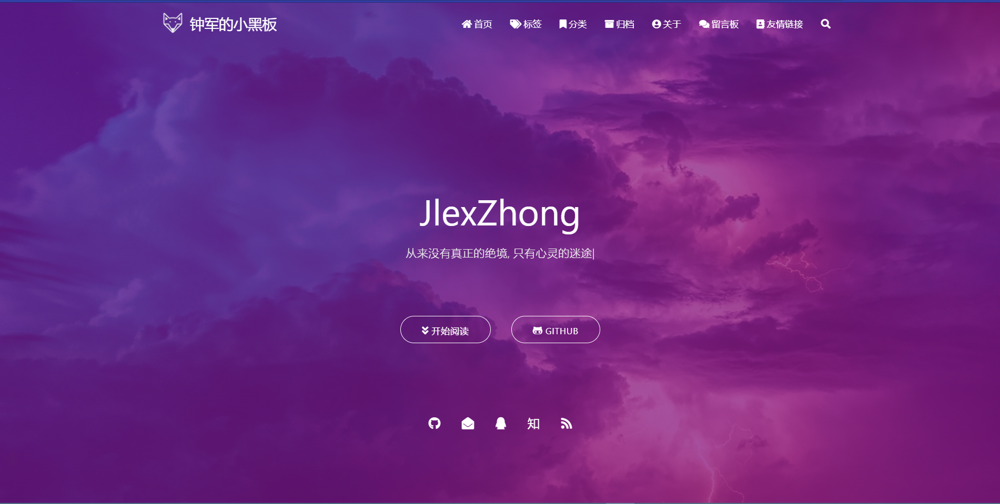
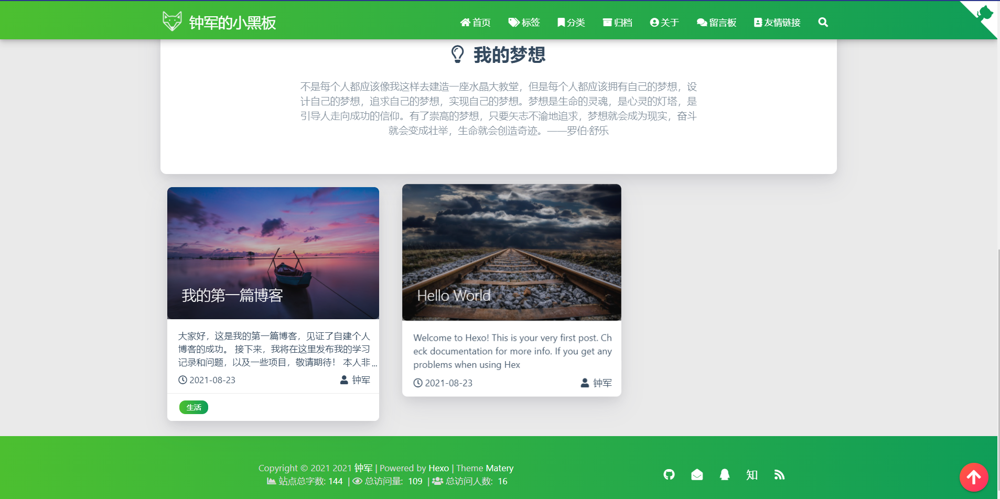
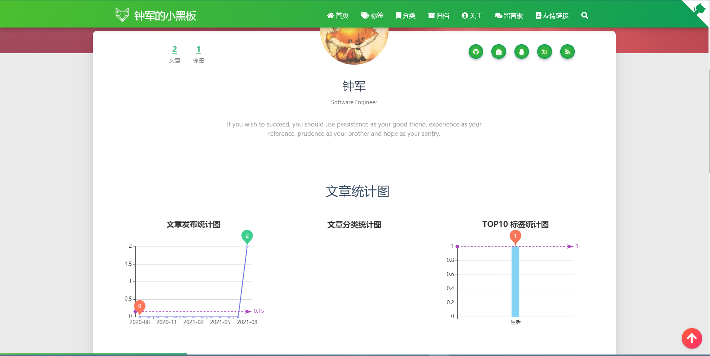

# Hexo+Github+matery免费搭建个人博客详细教程

## 效果图







## 安装

### 安装Node.js

安装**Node.js**，一直默认。输入：（查看是否安装正确）

```bash
  node -v
```

- 添加环境变量： `C:\Program Files\nodejs\ `

- 环境变量：`C:\Users\26780\AppData\Roaming\npm`

### 配置npm

查看**npm**是否安装成功：

```bash
npm -v
```

- 出现**BUG**：

```bash
npm install出现一直停留在“fetchMetadata: sill resolveWithNewModule find-cache-dir@“
```

- 解决：更换国内镜像源

```bash
更换成淘宝的源
npm config set registry https://registry.npm.taobao.org 
– 配置后可通过下面方式来验证是否成功 
npm config get registry 
– 或npm info express
```

### 安装**hexo**

```bash
npm config set registry https://registry.npm.taobao.org 
npm install -g hexo-cli
```

若出现warning，这是募捐提示，忽略即可

```bash
run `npm fund` for details
```

如果不想看到，输入命令：

```bash
npm install --no-fund
```

### 安装git

**Github**安装，教程网上很多请自行寻找，并配置好**SSH-Key**

## Hexo搭建

1. 建立空文件夹，我的是Blog，将来会在这个文件夹内存放与博客有关的内容

2. 打开GIt Bash 或者命令行，输入：

```bash
hexo init
```

3. 文件夹内会出现一些配置文件

   - `node_modules:` 依赖包
   - `public：`存放生成的页面
   - `scaffolds：`生成文章的一些模板
   - `source：`用来存放你的文章
   - `themes：`**主题**
   - `_config.yml:` 博客的**配置文件**

4. 执行：

```bash
hexo new hello Hexo    //新建一篇名为"hello Hexo"的博客
hexo g                 //生成静态文件
hexo s                 //本地部署预览
```

5. 会输出：

```bash
INFO  Hexo is running at http://localhost:4000 . Press Ctrl+C to stop.
```

可能会出现加载不了的情况，因为4000端口太常用了，导致冲突。使用：

```bash
hexo server -p 5000 //更改端口
```

### **hexo常用命令**

- 初始化

```bash
npm install hexo -g //安装Hexo
npm update hexo -g //升级 
hexo init //初始化博客
```

   - 命令简写

```bash
hexo n "我的博客" = hexo new "我的博客" //新建文章
hexo g = hexo generate //生成
hexo s = hexo server //启动服务预览
hexo d = hexo deploy //部署
```

   - 其他

```bash
hexo server //Hexo会监视文件变动并自动更新，无须重启服务器
hexo server -s //静态模式
hexo server -p 5000 //更改端口
hexo server -i 192.168.1.1 //自定义 IP
hexo clean //清除缓存，若是网页正常情况下可以忽略这条命令
```

## 推送网站

1. 修改Blog文件夹下的**_config.yml**，在末尾修改成如下格式：

```yaml
# Deployment
## Docs: https://hexo.io/docs/one-command-deployment
deploy:
type: git
repo: https://github.com/JlexZhong/JlexZhong.github.io.git
branch: main

```

   repo后的地址就是博客仓库的https地址

2. 安装git部署插件：

```bash
npm install hexo-deployer-git --save
```

3. 然后输入命令：

```bash
hexo clean //清理静态文件
hexo g //生成静态文件
hexo d //部署
```

4. 出现**bug**：

   解决：

   - 如果不是代理问题，在_config.yml文件中把repo：后的地址改为git@github.com:JlexZhong/JlexZhong.github.io.git

   - 是代理问题，清除代理

```bash
remote: Permission to JlexZhong/JlexZhong.github.io.git denied to junz2001.
fatal: unable to access 'https://github.com/JlexZhong/JlexZhong.github.io.git/': The requested URL returned error: 403
FATAL {
err: Error: Spawn failed
at ChildProcess.<anonymous> (E:\Blog\node_modules\hexo-util\lib\spawn.js:51:21)
at ChildProcess.emit (events.js:400:28)
at ChildProcess.cp.emit (E:\Blog\node_modules\cross-spawn\lib\enoent.js:34:29)
at Process.ChildProcess._handle.onexit (internal/child_process.js:277:12) {
code: 128
}
} Something's wrong. Maybe you can find the solution here: %s https://hexo.io/docs/troubleshooting.html
```

5. 此时博客已经上线啦！可以通过网络访问了。浏览器输入博客网站地址**xxxx.github.io**

6. **修改域名**：

   现在你的个人网站的地址是`yourname.github.io`，如果觉得这个网址逼格不太够，这就需要你设置个人域名了。但是需要花钱。

   > 我没有选择购买域名，等后期再来更新吧

### 发布博客：

- 先`hexo new post "article title"`新建一篇文章，
- 在博客文件夹，`Blog/source/_posts`目录下回多出一个Markdown文件，编写完markdown文件后，保存
- 根目录下输入`hexo g`生成静态网页
- 然后输入`hexo s`可以本地预览效果
- 最后输入`hexo d`上传到`github`上

### `_config.yml`**文件的修改建议**：

- 请修改 `_config.yml` 的 `url` 的值为你的网站主 `URL`（如：`http://xxx.github.io`）。
- 建议修改两个 `per_page` 的分页条数值为 `6` 的倍数，如：`12`、`18` 等，这样文章列表在各个屏幕下都能较好的显示。
- 如果你是中文用户，则建议修改 `language` 的值为 `zh-CN`。
- `subtitle`选项：在我使用的主题当中即为网页首页中间的字体块，若为空将显示为**subtitle**
- `post_asset_folder`选项设置为：true。当该配置被应用后，使用hexo new命令创建新文章时，会生成相同名字的文件夹，也就是文章资源文件夹。

## 向hexo博客中插入图片

- 进入博客根目录配置`_config.yml`:将`post_asset_folder: false·`改为`post_asset_folder: true`

- 安装插件:

```bash
npm install https://github.com/CodeFalling/hexo-asset-image -- save
```

- 此时再执行命令 :

```bash
hexo n article_name 
```

- 创建新的文章，在 source/_posts 中会生成文章 post_name.md 和同名文件夹 post_name,我们将文章中所使用到的将图片资源均放在 post_name 中，这时就可以在文章中使用相对路径引用图片资源了

- 添加图片:在想添加的位置写入``,例如``


## 文章Front-matter

`Front-matter` 是`md`文件最上方以 `---`分隔的区域，用于指定个别文件的变量.`Front-matter` 选项中的所有内容均为**非必填**的。但我仍然建议至少填写 `title` 和 `date` 的值。

### 选项详解

| 配置选项      | 默认值                         | 描述                                                         |
| ------------- | ------------------------------ | ------------------------------------------------------------ |
| title         | `Markdown` 的文件标题          | 文章标题，强烈建议填写此选项                                 |
| date          | 文件创建时的日期时间           | 发布时间，强烈建议填写此选项，且最好保证全局唯一             |
| author        | 根 `_config.yml` 中的 `author` | 文章作者                                                     |
| img           | `featureImages` 中的某个值     | 文章特征图，推荐使用图床(腾讯云、七牛云、又拍云等)来做图片的路径.如: `http://xxx.com/xxx.jpg` |
| top           | `true`                         | 推荐文章（文章是否置顶），如果 `top` 值为 `true`，则会作为首页推荐文章 |
| hide          | `false`                        | 隐藏文章，如果`hide`值为`true`，则文章不会在首页显示         |
| cover         | `false`                        | `v1.0.2`版本新增，表示该文章是否需要加入到首页轮播封面中     |
| coverImg      | 无                             | `v1.0.2`版本新增，表示该文章在首页轮播封面需要显示的图片路径，如果没有，则默认使用文章的特色图片 |
| password      | 无                             | 文章阅读密码，如果要对文章设置阅读验证密码的话，就可以设置 `password` 的值，该值必须是用 `SHA256` 加密后的密码，防止被他人识破。前提是在主题的 `config.yml` 中激活了 `verifyPassword` 选项 |
| toc           | `true`                         | 是否开启 TOC，可以针对某篇文章单独关闭 TOC 的功能。前提是在主题的 `config.yml` 中激活了 `toc` 选项 |
| mathjax       | `false`                        | 是否开启数学公式支持 ，本文章是否开启 `mathjax`，且需要在主题的 `_config.yml` 文件中也需要开启才行 |
| summary       | 无                             | 文章摘要，自定义的文章摘要内容，如果这个属性有值，文章卡片摘要就显示这段文字，否则程序会自动截取文章的部分内容作为摘要 |
| categories    | 无                             | 文章分类，本主题的分类表示宏观上大的分类，只建议一篇文章一个分类 |
| tags          | 无                             | 文章标签，一篇文章可以多个标签                               |
| keywords      | 文章标题                       | 文章关键字，SEO 时需要                                       |
| reprintPolicy | cc_by                          | 文章转载规则， 可以是 cc_by, cc_by_nd, cc_by_sa, cc_by_nc, cc_by_nc_nd, cc_by_nc_sa, cc0, noreprint 或 pay 中的一个 |

> **注意**:
>
> 1. 如果 `img` 属性不填写的话，文章特色图会根据文章标题的 `hashcode` 的值取余，然后选取主题中对应的特色图片，从而达到让所有文章的特色图**各有特色**。
> 2. `date` 的值尽量保证每篇文章是唯一的，因为本主题中 `Gitalk` 和 `Gitment` 识别 `id` 是通过 `date` 的值来作为唯一标识的。
> 3. 如果要对文章设置阅读验证密码的功能，不仅要在 Front-matter 中设置采用了 SHA256 加密的 password 的值，还需要在主题的 `_config.yml` 中激活了配置。有些在线的 SHA256 加密的地址，可供你使用：[开源中国在线工具](http://tool.oschina.net/encrypt?type=2)、[chahuo](http://encode.chahuo.com/)、[站长工具](http://tool.chinaz.com/tools/hash.aspx)。
> 4. 您可以在文章md文件的 front-matter 中指定 reprintPolicy 来给单个文章配置转载规则

以下为文章的 `Front-matter` 示例。


### 最简示例

```yaml
---
title: typora-vue-theme主题介绍
date: 2018-09-07 09:25:00
---
```

### 最全示例

```yaml
---
title: typora-vue-theme主题介绍
date: 2018-09-07 09:25:00
author: 赵奇
img: /source/images/xxx.jpg
top: true
hide: false
cover: true
coverImg: /images/1.jpg
password: 8d969eef6ecad3c29a3a629280e686cf0c3f5d5a86aff3ca12020c923adc6c92
toc: false
mathjax: false
summary: 这是你自定义的文章摘要内容，如果这个属性有值，文章卡片摘要就显示这段文字，否则程序会自动截取文章的部分内容作为摘要
categories: Markdown
tags:
  - Typora
  - Markdown
---
```

## 主题美化

1. 在哪找？

   https://hexo.io/themes/

2. cd 进blog文件夹根目录，输入：

```bash
git clone 主题http链接 themes/主题名称
```

   主题会下载到themes文件夹下。

3. 我用的是https://github.com/blinkfox/hexo-theme-matery，主题名称是blinkfox，所以输入：

```bash
git clone https://github.com/blinkfox/hexo-theme-matery themes/blinkfox
```

4. 在下载的主题文件夹内有**使用文档**，中英文版本十分友好。

5. 切换主题，找到根目录的_config.yml，将`landscape`改为`blinkfox`，也就是改为我们下载的主题名字：

```yaml
# Extensions
## Plugins: https://hexo.io/plugins/
## Themes: https://hexo.io/themes/
theme: landscape
```

6. 然后再次部署网站，`hexo g`，`hexo d`

### 主题更多个性化

我们可以通过修改根目录或者主题目录下的`_config.yml`，实现更多的**个性化**。当然，不同的主题的语法还有不同，修改方法请参考各主题的使用文档。例如：

- **代码高亮**

  从 Hexo5.0 版本开始自带了 `prismjs` 代码语法高亮的支持，本主题对此进行了改造支持。

  如果你的博客中曾经安装过 `hexo-prism-plugin` 的插件，那么你须要执行 `npm uninstall hexo-prism-plugin` 来卸载掉它，否则生成的代码中会有 `&#123;` 和 `&#125;` 的转义字符。

  然后，修改 Hexo 根目录下 `_config.yml` 文件中 `highlight.enable` 的值为 `false`，并将 `prismjs.enable` 的值设置为 `true`，主要配置如下：

```yaml
highlight:
enable: false
line_number: true
auto_detect: false
tab_replace: ''
wrap: true
hljs: false
prismjs:
enable: true
preprocess: true
line_number: true
tab_replace: ''
```

- **文章字数统计插件**（建议安装）

  如果你想要在文章中显示文章字数、阅读时长信息，可以安装 [hexo-wordcount](https://github.com/willin/hexo-wordcount)插件。

  安装命令如下：

```bash
npm i --save hexo-wordcount
```

  然后只需在本主题下的 `_config.yml` 文件中，将各个文章字数相关的配置激活即可：

```yaml
postInfo:
date: true
update: false
wordCount: false # 设置文章字数统计为 true.
totalCount: false # 设置站点文章总字数统计为 true.
min2read: false # 阅读时长.
readCount: false # 阅读次数.
```

- 更多请查看主题使用文档

## Github & Coding Pages 双部署

后续更新

## 参考

https://reclusew.github.io/2021/08/12/blog-setup/

https://sunhwee.com/posts/6e8839eb.html#toc-heading-65

https://blog.csdn.net/weixin_42334475/article/details/101055364?utm_medium=distribute.pc_relevant.none-task-blog-2%7Edefault%7EBlogCommendFromBaidu%7Edefault-5.control&depth_1-utm_source=distribute.pc_relevant.none-task-blog-2%7Edefault%7EBlogCommendFromBaidu%7Edefault-5.control

https://blog.csdn.net/Fitz1318/article/details/86548129?ops_request_misc=%257B%2522request%255Fid%2522%253A%2522162977080816780269848140%2522%252C%2522scm%2522%253A%252220140713.130102334..%2522%257D&request_id=162977080816780269848140&biz_id=0&utm_medium=distribute.pc_search_result.none-task-blog-2~all~sobaiduend~default-2-86548129.pc_search_result_control_group&utm_term=hexo+%E6%8F%92%E5%85%A5%E5%9B%BE%E7%89%87&spm=1018.2226.3001.4187

## 总结

看到这里，相信您已经搭建出自己的个人博客网站了！

