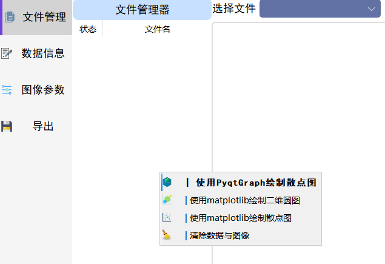

# pyqt小记 | 添加右键菜单，添加图标和点击事件

```python
    def contextMenuEvent(self, pos):
        """

        右键菜单
        :param pos:
        :return:
        """
        self.contextMenu = QMenu()
        self.action_pgPlot = self.contextMenu.addAction(
            QIcon("./icons/logo.ico"), u'| 使用PyqtGraph绘制散点图')
        self.action_plotCircle = self.contextMenu.addAction(
            QIcon("./icons/plot.ico"), u'| 使用matplotlib绘制二维圆图')
        self.action_plotPoint = self.contextMenu.addAction(
            QIcon("./icons/plotPoint.png"), u'| 使用matplotlib绘制散点图')
        self.action_clear_dataView = self.contextMenu.addAction(
            QIcon("./icons/clear.ico"), u'| 清除数据与图像')
        self.contextMenu.popup(QCursor.pos())  # 菜单显示的位置
        self.action_plotCircle.triggered.connect(self.plotAllSlot_circle)
        self.action_plotPoint.triggered.connect(self.plotAllSlot_point)
        self.action_pgPlot.triggered.connect(self.pg_plot)
        font = QtGui.QFont()
        font.setFamily("黑体")
        font.setPointSize(10)
        font.setBold(True)
        self.action_pgPlot.setFont(font)
        self.action_clear_dataView.triggered.connect(self.clear_dataView)
        self.contextMenu.show()
```

类继承于QTableView

**效果：**



