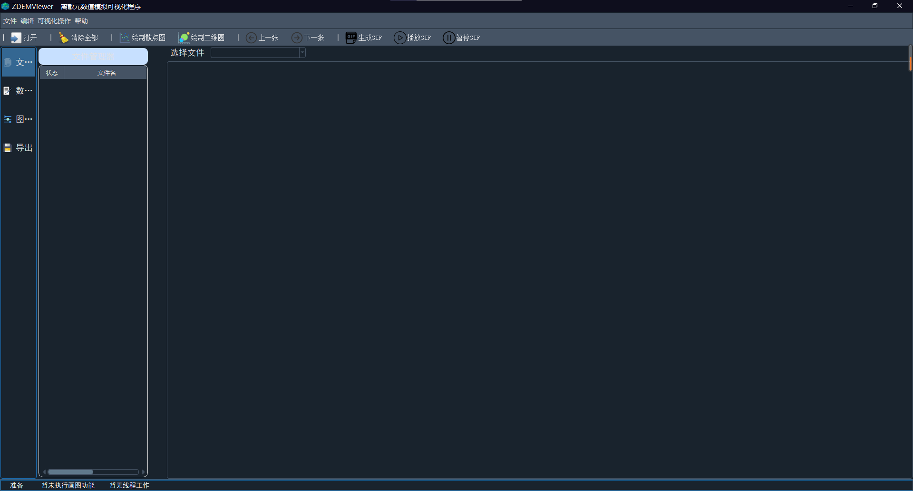

# pyqt5小记| QSS开源暗黑主题qdarkstyle ，读取QSS主题文件

## 安装

```python
Pip install qdarkstyle
```

## 使用

```python
import sys
from PyQt5.QtGui import QIcon
import qdarkstyle
from PyQt5 import QtCore
from PyQt5.QtWidgets import QApplication,  QMainWindow

if __name__ == '__main__':
    app = QApplication(sys.argv)
    app.setAttribute(QtCore.Qt.AA_EnableHighDpiScaling)  # 适应高分辨率
    # qdarkstyle
    # 设置qdarkstyle！！！
    app.setStyleSheet(qdarkstyle.load_stylesheet())
    #
	myMainWindow = QMainWindow()
    myUi = wMain.Ui_MainWindow()
    myUi.setupUi(myMainWindow)
    myMainWindow.setWindowTitle('ZDEMViewer    离散元数值模拟可视化程序')
    myMainWindow.setWindowIcon(QIcon("./icons/logo.ico"))
    myMainWindow.show()
    sys.exit(app.exec_())
```

## 效果



## 如何读取QSS文件作为GUI主题

```python
with open('./QSS/myQSS.qss', encoding='utf-8') as f:
	qss = f.read()
app.setStyleSheet(qss)  # 设置主题
```
