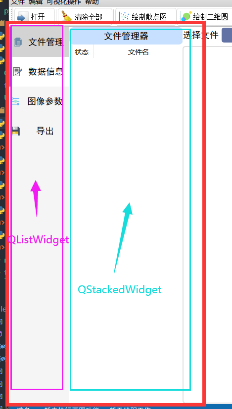

# pyqt小记|侧边栏（QListWidget+QStackedWidget）实现

## 效果


## 思路

- 左边是**listwidget**，右边是**stackedwidget**。
- 点击listwidget的不同item，跳转到stackedwidget不同的页面。
- 最后通过**qss美化**。



## 实现

### 初始化界面

```python
def init_leftWidget(self):
    # self.leftFrame是父组件
    self.leftFrame_HLayout = QtWidgets.QHBoxLayout(self.leftFrame)
   	self.leftFrame_HLayout.setSpacing(0)  
  	self.leftFrame_HLayout.setContentsMargins(0,0,0,0) 
  	self.leftFrame_HLayout.setAlignment(QtCore.Qt.AlignCenter)  
    # 实例化两个组件
   	self.left_list_widget = QtWidgets.QListWidget(self.leftFrame)
   	self.left_stacked_widget = QtWidgets.QStackedWidget(self.leftFrame)
   	self.left_stacked_widget.setContentsMargins(0,0,0,0)
   	self.leftFrame_HLayout.addWidget(self.left_list_widget)
   	self.leftFrame_HLayout.addWidget(self.left_stacked_widget) 				       						         self.left_list_widget.setFrameShape(QtWidgets.QListWidget.NoFrame) # 去除边框
    self.left_list_widget.setVerticalScrollBarPolicy(Qt.ScrollBarPolicy.ScrollBarAlwaysOff)  # 隐藏垂直滚动条
    self.left_list_widget.setHorizontalScrollBarPolicy(Qt.ScrollBarPolicy.ScrollBarAlwaysOff)# 隐藏水平滚动条
    # 设置字体
    font_1 = QtGui.QFont()
    font_1.setFamily("黑体")
    font_1.setPointSize(12)
    font_1.setBold(False)
    self.left_list_widget.setFont(font_1)
    # 文件管理
    dataView_icon = QtGui.QIcon()
    dataView_icon.addPixmap(QtGui.QPixmap("./icons/dataView.png"),
    QtGui.QIcon.Normal, QtGui.QIcon.Off)
    self.dataView_item = QtWidgets.QListWidgetItem(dataView_icon,'文件管理',self.left_list_widget)
    self.dataView_item.setSizeHint(QSize(30,60))
    self.dataView_item.setTextAlignment(QtCore.Qt.AlignCenter)
    # 数据信息
    dataLog_icon = QtGui.QIcon()
    dataLog_icon.addPixmap(QtGui.QPixmap("./icons/dataLog.png"),
    QtGui.QIcon.Normal, QtGui.QIcon.Off)
    self.dataLog_item = QtWidgets.QListWidgetItem(dataLog_icon,'数据信息',self.left_list_widget)
    self.dataLog_item.setSizeHint(QSize(30,60))
    self.dataLog_item.setTextAlignment(QtCore.Qt.AlignCenter)
    # 图像参数
    param_icon = QtGui.QIcon()
    param_icon.addPixmap(QtGui.QPixmap("./icons/figureParam.png"),
    QtGui.QIcon.Normal, QtGui.QIcon.Off)
    self.param_item = QtWidgets.QListWidgetItem(param_icon,'图像参数',self.left_list_widget)
    self.param_item.setSizeHint(QSize(30,60))
    self.param_item.setTextAlignment(QtCore.Qt.AlignCenter)
    # 导出
    export_icon = QtGui.QIcon()
    export_icon.addPixmap(QtGui.QPixmap("./icons/save.png"),
    QtGui.QIcon.Normal, QtGui.QIcon.Off)
    self.export_item = QtWidgets.QListWidgetItem(export_icon,'导出',self.left_list_widget)
    self.export_item.setSizeHint(QSize(30,60))
    self.export_item.setTextAlignment(QtCore.Qt.AlignCenter)
    self.export_item.whatsThis()
    # 为listitem添加点击事件，切换stackedwidget页面
    self.left_list_widget.itemClicked.connect(self.item_clicked)
```

### 点击事件，实现窗口的切换

```python
    def item_clicked(self):
        # 获取当前选中的item
        item = self.left_list_widget.selectedItems()[0]
        if item.text() == '文件管理':
            self.switch_dataView()
        elif (item.text() == '数据信息'):
            self.switch_dataLog()
        elif item.text() == '图像参数':
            self.switch_paramWidget()
        else:
            self.switch_export()
```

### QSS美化

.qss文件：

```
QListWidget, QListView, QTreeWidget, QTreeView {
    outline: 0px;
}

QListWidget {
    min-width: 120px;
    max-width: 120px;
    color: Black;
    background: #F5F5F5;
}

QListWidget::Item:hover {
	background: rgb(255, 255, 255);
    border-left: 5px solid rgb(112, 66, 219);
}

QListWidget::Item:selected {
    background: lightGray;
    border-left: 5px solid rgb(112, 66, 219);
}
HistoryPanel:hover {
    background: rgb(52, 52, 52);
}
```
