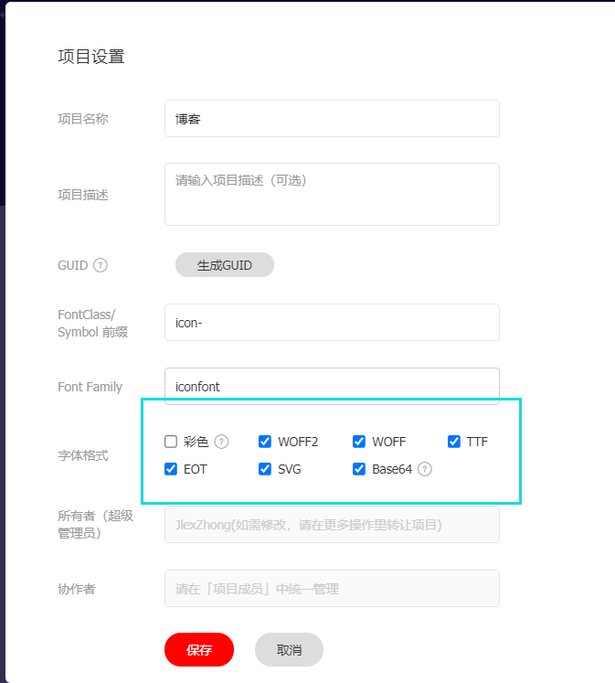
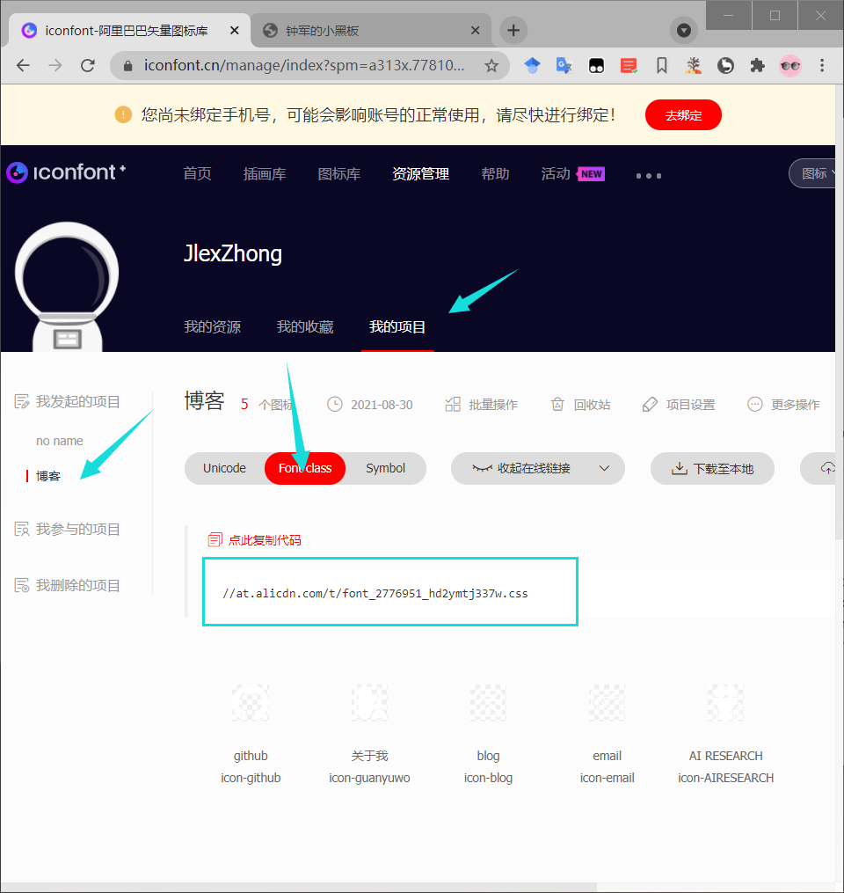

# 🎃一个坏掉的番茄个人主页——魔改教程、遇坑总结

**主页模板地址**：`https://github.com/Tomotoes/HomePage`

**中文使用文档**：`https://github.com/Tomotoes/HomePage/blob/master/README.zh_CN.md`

配置步骤在作者的使用文档中写的以及非常详细了，我总结一下如何**自定义**。

##  标题、文字、头像

在`config.json`

```json
{
	"head": {
		"title": "钟军的小黑板",
		"description": "Author:Jlex Zhong,Category:Personal Blog",
		"favicon": "favicon.ico"  // 暂未找到网站图标的修改方法
	},
	"intro": {
		"title": "Jlex Zhong",
		"subtitle": "Wellcome to my HomePage",
		"enter": "enter",
		"supportAuthor": true,
		"background": true
	},
	"main": {
		"name": "Jlex Zhong",
		"signature": "向日葵晚上在干啥呢？", 
		"avatar": {
			"link": "assets/avatar.jpg", // 头像，将路径下的图片替换即可
			"height": "100",
			"width": "100"
		},
```

## 增加页面

在`config.json`中

```
		"ul": {
			"first": {
				"href": "blog/",
				"icon": "blog",
				"text": "Blog"
			},
			"second": {
				"href": "blog/about/",
				"icon": "guanyuwo",
				"text": "About Me"
			},
			"third": {
				"href": "mailto:junzhong0917@163.com",
				"icon": "email",
				"text": "Email"
			},			
			"fourth": {
				"href": "blog/about/",  //我添加的页面
				"icon": "AIRESEARCH",
				"text": "AI Lab"
			},
			"five": {
				"href": "https://github.com/JlexZhong",
				"icon": "github",
				"text": "Github"
			}
```

在`src\components\main.pug`

```pug
			ul
				li
					a(href=`${first.href}` aria-label=`${first.text}`)
						i(class=`icon icon-${first.icon}`)
						span(data-translate=`${first.text}`) #{first.text}

				li
					a(href=`${second.href}` aria-label=`${second.text}`)
						i(class=`icon icon-${second.icon}`)
						span(data-translate=`${second.text}`) #{second.text}

				li
					a(href=`${third.href}` aria-label=`${third.text}` target="_blank")
						i(class=`icon icon-${third.icon}`)
						span(data-translate=`${third.text}`) #{third.text}

				li
					a(href=`${fourth.href}` aria-label=`${fourth.text}` target="_blank")
						i(class=`icon icon-${fourth.icon}`)
						span(data-translate=`${fourth.text}`) #{fourth.text}
				li
					a(href=`${five.href}` aria-label=`${five.text}` target="_blank")
						i(class=`icon icon-${five.icon}`)
						span(data-translate=`${five.text}`) #{five.text}

```


## 更换图标

1. 到阿里矢量图标网站中找到自己的图标，并添加到一个项目中。https://www.iconfont.cn/
2. 把图标调成白色
3. 进入项目设置，把这些勾选上
4. 
5. 点击Font Class, 查看在线链接，点击该链接
6. 
7. 复制链接中的所有内容，除了以下部分，其余全部替换掉。

```
.icon {
	display: block;
	width: 1.5em;
	height: 1.5em;
	margin: 0 auto;
	fill: currentColor;
	font-family: 'iconfont' !important;
	font-size: inherit;
	font-style: normal;
	-webkit-font-smoothing: antialiased;
	-moz-osx-font-smoothing: grayscale;
}

```

最后去`config.json`中修改图标的名称，不用加`icon-`。


